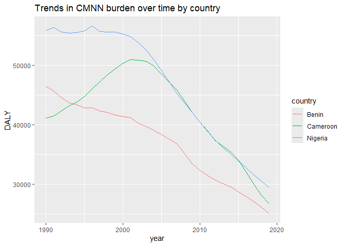
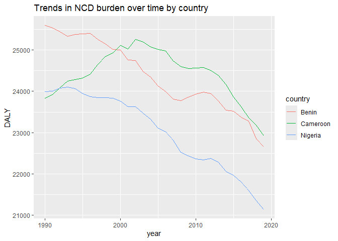
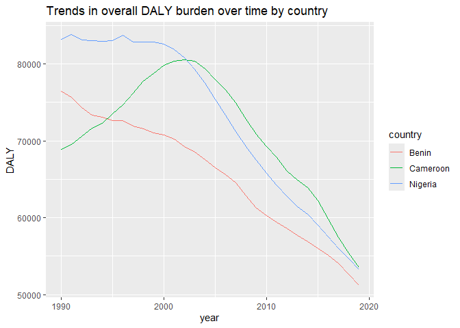

Global Disease Burden Analysis
================
Rosaline, Ijeoma,Elihun

# Introduction

This document compares the Disability-Adjusted Life Year (DALY) diseases
burden for three countries: Cameroon, Benin, and Nigeria. We compare the
burden due to communicable, maternal, neonatal, and nutritional diseases
(CMNN), non-communicable diseases (NCDs), and overall disease burden for
these countries.

The source data is from the Institute for Health Metrics and Evaluation
(IHME) Global Burden of Disease (GBD) study.

# Communicable, Maternal, Neonatal, and Nutritional Disease Burden (CMNN)

## Table of Estimates for CMNN Burden Over Time

| year |    Benin | Cameroon |  Nigeria |
|-----:|---------:|---------:|---------:|
| 1990 | 46486.57 | 41138.97 | 55858.01 |
| 1991 | 45739.86 | 41501.22 | 56402.61 |
| 1992 | 44593.95 | 42386.18 | 55584.80 |
| 1993 | 43724.30 | 43239.73 | 55462.25 |
| 1994 | 43363.40 | 43789.90 | 55563.10 |
| 1995 | 42832.16 | 44802.07 | 55778.38 |
| 1996 | 42829.97 | 46026.84 | 56608.97 |
| 1997 | 42325.98 | 47234.92 | 55670.89 |
| 1998 | 42088.41 | 48478.10 | 55633.69 |
| 1999 | 41663.56 | 49450.97 | 55610.97 |
| 2000 | 41441.71 | 50332.81 | 55309.83 |
| 2001 | 41199.29 | 50983.40 | 54828.09 |
| 2002 | 40261.63 | 50842.00 | 53795.58 |
| 2003 | 39754.88 | 50674.60 | 52594.17 |
| 2004 | 39052.45 | 49887.67 | 50933.61 |
| 2005 | 38352.29 | 48568.37 | 49195.49 |
| 2006 | 37598.69 | 47215.00 | 47222.66 |
| 2007 | 36817.58 | 45860.13 | 45320.76 |
| 2008 | 35168.62 | 43976.64 | 43735.33 |
| 2009 | 33466.29 | 42111.32 | 42069.10 |
| 2010 | 32388.35 | 40455.95 | 40429.09 |
| 2011 | 31527.01 | 39016.70 | 38900.83 |
| 2012 | 30707.77 | 37393.81 | 37432.21 |
| 2013 | 30150.57 | 36368.89 | 36186.87 |
| 2014 | 29630.13 | 35419.80 | 35085.94 |
| 2015 | 28741.84 | 34056.23 | 33891.85 |
| 2016 | 27954.84 | 32069.77 | 32791.92 |
| 2017 | 27065.90 | 30020.81 | 31579.39 |
| 2018 | 26195.00 | 28132.24 | 30540.72 |
| 2019 | 25070.46 | 26802.97 | 29467.82 |

## Plot Showing Trends in CMNN Burden Over Time

<!-- -->

## Summary of CMNN Burden Findings

A comparison of CMNN disease burden between Cameroon ,Nigeria and Benin
shows a general downward trend. However, Cameroon had a higher CMNN
burden in the year 2000.

# Non-Communicable Disease Burden (NCD)

## Table of Estimates for NCD Burden Over Time

| year |    Benin | Cameroon |  Nigeria |
|-----:|---------:|---------:|---------:|
| 1990 | 25592.72 | 23834.27 | 23994.43 |
| 1991 | 25535.74 | 23923.30 | 24005.55 |
| 1992 | 25439.81 | 24090.37 | 24073.41 |
| 1993 | 25333.48 | 24248.28 | 24103.21 |
| 1994 | 25379.18 | 24283.03 | 24068.17 |
| 1995 | 25389.34 | 24324.84 | 23947.07 |
| 1996 | 25405.16 | 24420.38 | 23875.00 |
| 1997 | 25254.91 | 24648.36 | 23852.26 |
| 1998 | 25145.00 | 24841.19 | 23844.55 |
| 1999 | 25011.18 | 24933.53 | 23833.43 |
| 2000 | 25005.28 | 25108.66 | 23763.60 |
| 2001 | 24753.36 | 25020.62 | 23631.43 |
| 2002 | 24743.49 | 25258.55 | 23629.69 |
| 2003 | 24480.81 | 25198.23 | 23472.64 |
| 2004 | 24349.45 | 25069.23 | 23329.15 |
| 2005 | 24126.48 | 25012.86 | 23101.87 |
| 2006 | 23995.21 | 24974.57 | 23016.59 |
| 2007 | 23807.42 | 24736.90 | 22813.20 |
| 2008 | 23774.74 | 24599.92 | 22528.84 |
| 2009 | 23854.86 | 24557.26 | 22435.62 |
| 2010 | 23927.69 | 24560.98 | 22360.91 |
| 2011 | 23978.54 | 24576.17 | 22343.36 |
| 2012 | 23940.86 | 24498.33 | 22376.80 |
| 2013 | 23765.69 | 24381.43 | 22276.31 |
| 2014 | 23541.17 | 24164.49 | 22064.38 |
| 2015 | 23513.92 | 23861.86 | 21964.47 |
| 2016 | 23371.82 | 23630.89 | 21802.05 |
| 2017 | 23277.85 | 23367.51 | 21594.53 |
| 2018 | 22851.36 | 23174.43 | 21350.80 |
| 2019 | 22656.17 | 22920.36 | 21141.61 |

## Plot Showing Trends in NCD Burden Over Time

<!-- -->

## Summary of NCD Burden Findings

The burden of NCD showed a general decline across all three countries
although Cameroon had a higher burden in the year 2000.

# Overall Disease Burden

## Table of Estimates for Overall Disease Burden Over Time

| year |    Benin | Cameroon |  Nigeria |
|-----:|---------:|---------:|---------:|
| 1990 | 76403.94 | 68929.65 | 83225.66 |
| 1991 | 75620.35 | 69481.74 | 83782.38 |
| 1992 | 74338.70 | 70568.05 | 83103.23 |
| 1993 | 73357.47 | 71637.18 | 82991.49 |
| 1994 | 73072.23 | 72296.72 | 82969.94 |
| 1995 | 72604.36 | 73505.33 | 83026.21 |
| 1996 | 72599.56 | 74680.32 | 83770.22 |
| 1997 | 71933.88 | 76180.62 | 82829.75 |
| 1998 | 71566.36 | 77749.43 | 82842.87 |
| 1999 | 70994.21 | 78779.13 | 82873.98 |
| 2000 | 70789.62 | 79860.98 | 82601.23 |
| 2001 | 70191.95 | 80371.50 | 81850.25 |
| 2002 | 69253.13 | 80567.90 | 80780.64 |
| 2003 | 68528.76 | 80376.06 | 79278.81 |
| 2004 | 67543.70 | 79357.22 | 77540.38 |
| 2005 | 66532.48 | 77986.34 | 75379.06 |
| 2006 | 65619.61 | 76593.37 | 73330.45 |
| 2007 | 64573.58 | 74923.57 | 71176.37 |
| 2008 | 62855.29 | 72827.80 | 69242.37 |
| 2009 | 61272.26 | 70859.98 | 67483.05 |
| 2010 | 60274.68 | 69232.83 | 65739.92 |
| 2011 | 59430.04 | 67800.61 | 64174.38 |
| 2012 | 58568.03 | 66033.78 | 62740.79 |
| 2013 | 57737.94 | 64866.11 | 61468.45 |
| 2014 | 56921.23 | 63914.62 | 60410.35 |
| 2015 | 56049.19 | 62261.64 | 59034.54 |
| 2016 | 55080.48 | 59839.35 | 57477.91 |
| 2017 | 54055.21 | 57413.29 | 56018.08 |
| 2018 | 52629.64 | 55421.01 | 54681.25 |
| 2019 | 51242.96 | 53559.01 | 53229.60 |

## Plot Showing Trends in Overall Disease Burden Over Time

<!-- -->

## Summary of Overall Disease Burden Findings

Overall there was a decline in the overall burden DALY diseases across
all 3 countries.
