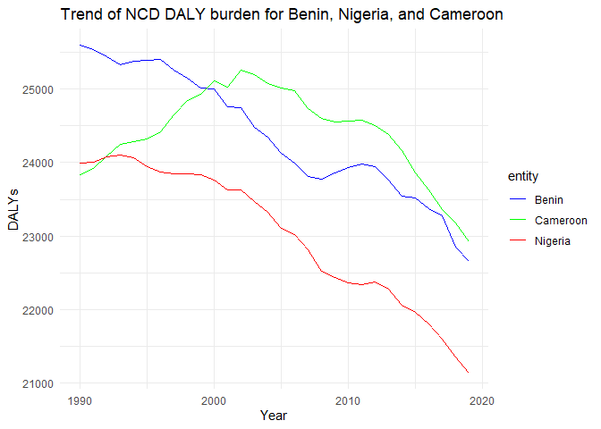

Global Disease Burden Analysis
================
Ijeoma Iwuora

# Introduction

This document compares the Disability-Adjusted Life Year (DALY) diseases
burden for three countries: Benin, Cameroon, and Nigeira. We compare the
burden due to communicable, maternal, neonatal, and nutritional diseases
(CMNN), non-communicable diseases (NCDs), and overall disease burden for
these countries.

The source data is from the Institute for Health Metrics and Evaluation
(IHME) Global Burden of Disease (GBD) study.

# Non-Communicable Disease Burden (NCD)

    ## Rows: 8010 Columns: 4
    ## ── Column specification ────────────────────────────────────────────────────────
    ## Delimiter: ","
    ## chr (2): Entity, Code
    ## dbl (2): Year, DALYs (Disability-Adjusted Life Years) - Non-communicable dis...
    ## 
    ## ℹ Use `spec()` to retrieve the full column specification for this data.
    ## ℹ Specify the column types or set `show_col_types = FALSE` to quiet this message.

## Table of Estimates for NCD Burden Over Time

| code | year |    Benin | Cameroon |  Nigeria |
|:-----|-----:|---------:|---------:|---------:|
| BEN  | 1990 | 25592.72 |       NA |       NA |
| BEN  | 1991 | 25535.74 |       NA |       NA |
| BEN  | 1992 | 25439.81 |       NA |       NA |
| BEN  | 1993 | 25333.48 |       NA |       NA |
| BEN  | 1994 | 25379.18 |       NA |       NA |
| BEN  | 1995 | 25389.34 |       NA |       NA |
| BEN  | 1996 | 25405.16 |       NA |       NA |
| BEN  | 1997 | 25254.91 |       NA |       NA |
| BEN  | 1998 | 25145.00 |       NA |       NA |
| BEN  | 1999 | 25011.18 |       NA |       NA |
| BEN  | 2000 | 25005.28 |       NA |       NA |
| BEN  | 2001 | 24753.36 |       NA |       NA |
| BEN  | 2002 | 24743.49 |       NA |       NA |
| BEN  | 2003 | 24480.81 |       NA |       NA |
| BEN  | 2004 | 24349.45 |       NA |       NA |
| BEN  | 2005 | 24126.48 |       NA |       NA |
| BEN  | 2006 | 23995.21 |       NA |       NA |
| BEN  | 2007 | 23807.42 |       NA |       NA |
| BEN  | 2008 | 23774.74 |       NA |       NA |
| BEN  | 2009 | 23854.86 |       NA |       NA |
| BEN  | 2010 | 23927.69 |       NA |       NA |
| BEN  | 2011 | 23978.54 |       NA |       NA |
| BEN  | 2012 | 23940.86 |       NA |       NA |
| BEN  | 2013 | 23765.69 |       NA |       NA |
| BEN  | 2014 | 23541.17 |       NA |       NA |
| BEN  | 2015 | 23513.92 |       NA |       NA |
| BEN  | 2016 | 23371.82 |       NA |       NA |
| BEN  | 2017 | 23277.85 |       NA |       NA |
| BEN  | 2018 | 22851.36 |       NA |       NA |
| BEN  | 2019 | 22656.17 |       NA |       NA |
| CMR  | 1990 |       NA | 23834.27 |       NA |
| CMR  | 1991 |       NA | 23923.30 |       NA |
| CMR  | 1992 |       NA | 24090.37 |       NA |
| CMR  | 1993 |       NA | 24248.28 |       NA |
| CMR  | 1994 |       NA | 24283.03 |       NA |
| CMR  | 1995 |       NA | 24324.84 |       NA |
| CMR  | 1996 |       NA | 24420.38 |       NA |
| CMR  | 1997 |       NA | 24648.36 |       NA |
| CMR  | 1998 |       NA | 24841.19 |       NA |
| CMR  | 1999 |       NA | 24933.53 |       NA |
| CMR  | 2000 |       NA | 25108.66 |       NA |
| CMR  | 2001 |       NA | 25020.62 |       NA |
| CMR  | 2002 |       NA | 25258.55 |       NA |
| CMR  | 2003 |       NA | 25198.23 |       NA |
| CMR  | 2004 |       NA | 25069.23 |       NA |
| CMR  | 2005 |       NA | 25012.86 |       NA |
| CMR  | 2006 |       NA | 24974.57 |       NA |
| CMR  | 2007 |       NA | 24736.90 |       NA |
| CMR  | 2008 |       NA | 24599.92 |       NA |
| CMR  | 2009 |       NA | 24557.26 |       NA |
| CMR  | 2010 |       NA | 24560.98 |       NA |
| CMR  | 2011 |       NA | 24576.17 |       NA |
| CMR  | 2012 |       NA | 24498.33 |       NA |
| CMR  | 2013 |       NA | 24381.43 |       NA |
| CMR  | 2014 |       NA | 24164.49 |       NA |
| CMR  | 2015 |       NA | 23861.86 |       NA |
| CMR  | 2016 |       NA | 23630.89 |       NA |
| CMR  | 2017 |       NA | 23367.51 |       NA |
| CMR  | 2018 |       NA | 23174.43 |       NA |
| CMR  | 2019 |       NA | 22920.36 |       NA |
| NGA  | 1990 |       NA |       NA | 23994.43 |
| NGA  | 1991 |       NA |       NA | 24005.55 |
| NGA  | 1992 |       NA |       NA | 24073.41 |
| NGA  | 1993 |       NA |       NA | 24103.21 |
| NGA  | 1994 |       NA |       NA | 24068.17 |
| NGA  | 1995 |       NA |       NA | 23947.07 |
| NGA  | 1996 |       NA |       NA | 23875.00 |
| NGA  | 1997 |       NA |       NA | 23852.26 |
| NGA  | 1998 |       NA |       NA | 23844.55 |
| NGA  | 1999 |       NA |       NA | 23833.43 |
| NGA  | 2000 |       NA |       NA | 23763.60 |
| NGA  | 2001 |       NA |       NA | 23631.43 |
| NGA  | 2002 |       NA |       NA | 23629.69 |
| NGA  | 2003 |       NA |       NA | 23472.64 |
| NGA  | 2004 |       NA |       NA | 23329.15 |
| NGA  | 2005 |       NA |       NA | 23101.87 |
| NGA  | 2006 |       NA |       NA | 23016.59 |
| NGA  | 2007 |       NA |       NA | 22813.20 |
| NGA  | 2008 |       NA |       NA | 22528.84 |
| NGA  | 2009 |       NA |       NA | 22435.62 |
| NGA  | 2010 |       NA |       NA | 22360.91 |
| NGA  | 2011 |       NA |       NA | 22343.36 |
| NGA  | 2012 |       NA |       NA | 22376.80 |
| NGA  | 2013 |       NA |       NA | 22276.31 |
| NGA  | 2014 |       NA |       NA | 22064.38 |
| NGA  | 2015 |       NA |       NA | 21964.47 |
| NGA  | 2016 |       NA |       NA | 21802.05 |
| NGA  | 2017 |       NA |       NA | 21594.53 |
| NGA  | 2018 |       NA |       NA | 21350.80 |
| NGA  | 2019 |       NA |       NA | 21141.61 |

## Plot Showing Trends in NCD Burden Over Time

<!-- -->

## Summary of NCD Burden Findings

Provide a brief analysis based on the data presented in the table and
chart. Highlight any significant findings or patterns. About 3
sentences.

## Nigeria and Benin have experienced a downward trend since the 1990s, while Cameroon exhibited an upward trend between 1990 and the early 2000s before experiencing a decline. Despite this, Nigeria has the lowest burden of NCD DALYs among the three countries.
